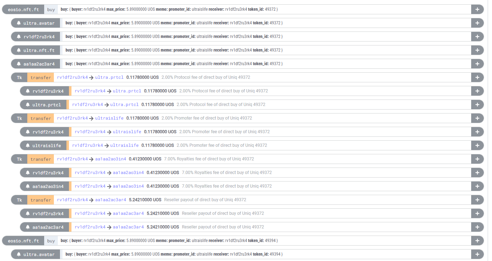

# Action Tree

A single transaction can contain multiple actions of the same type, such as `buy`. Since an action can itself be a group of sub-actions, we need an effective way to associate these sub-actions with their parent actions.

For example, if you examine a transaction like `6a275ebf480a8c17b76ad8df25a5a84bf65099b8f1d203dc98604760ebb9bde8` in the [Ultra Explorer](https://explorer.mainnet.ultra.io/tx/6a275ebf480a8c17b76ad8df25a5a84bf65099b8f1d203dc98604760ebb9bde8), you can see that DFuse generates a hierarchical tree structure for actions:



To create this tree structure, we rely on four fields:

### Action Fields

- **`actionOrdinal`**: The unique identifier for each action within the transaction (in incremental order).
- **`creatorActionOrdinal`**: The unique identifier of the parent action.
- **`closestUnnotifiedAncestorActionOrdinal`**: (Further details needed; currently unclear.)
- **`executionIndex`**: Provides the order in which actions are executed within the transaction (in incremental order).

For instance, to determine that the second `ultra.avatar` action is linked to the first action, we refer to the `creatorActionOrdinal` value, which is set to `1`.

### JSON Example

Here’s a sample of an `actionTraces` JSON object:

```
"actionTraces": [
    {
        "actionOrdinal": 1,
        "executionIndex": 0
    },
    {
        "actionOrdinal": 3,
        "creatorActionOrdinal": 1,
        "closestUnnotifiedAncestorActionOrdinal": 1,
        "executionIndex": 1
    },
    {
        "actionOrdinal": 7,
        "creatorActionOrdinal": 1,
        "closestUnnotifiedAncestorActionOrdinal": 1,
        "executionIndex": 5
    },
    {
        "actionOrdinal": 11,
        "creatorActionOrdinal": 7,
        "closestUnnotifiedAncestorActionOrdinal": 7,
        "executionIndex": 6
    }
]
```
